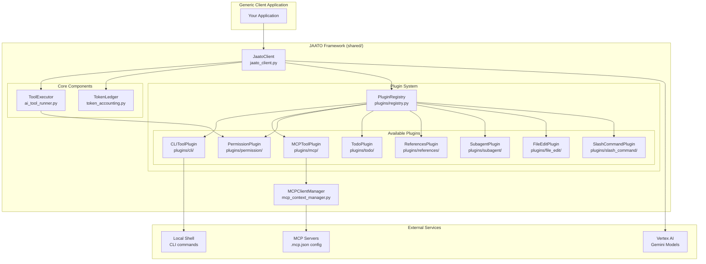
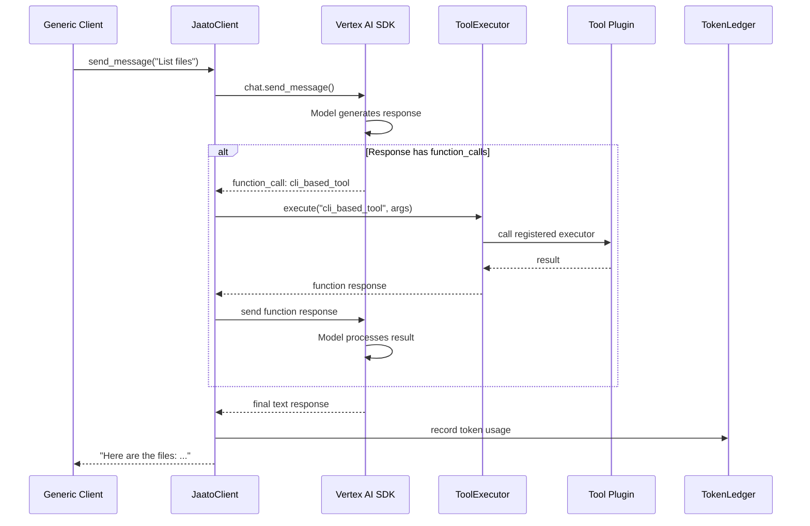
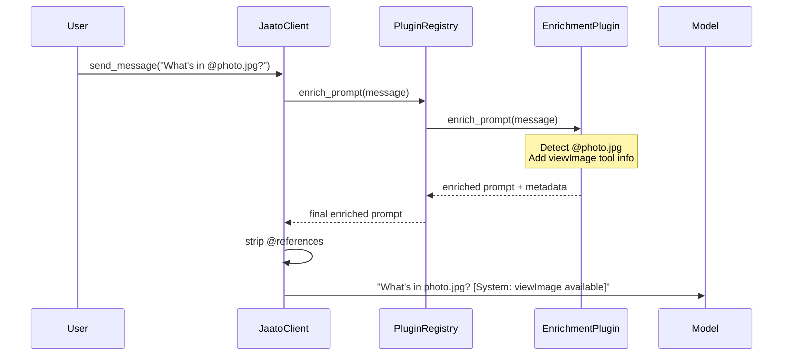

# JAATO Framework Architecture

This document describes the architecture of the jaato framework and how a generic client uses it.

## High-Level Overview

```
┌─────────────────────────────────────────────────────────────────────────────┐
│                           GENERIC CLIENT APPLICATION                         │
│  (Your code that wants to use AI with tools)                                │
└─────────────────────────────────────────────┬───────────────────────────────┘
                                              │
                                              ▼
┌─────────────────────────────────────────────────────────────────────────────┐
│                              JaatoClient                                     │
│  ┌─────────────────────────────────────────────────────────────────────┐    │
│  │  Public API:                                                         │    │
│  │  • connect(project, location, model)                                │    │
│  │  • configure_tools(registry, permission_plugin, ledger)             │    │
│  │  • send_message(message) → response                                 │    │
│  │  • get_history() / reset_session()                                  │    │
│  │  • get_context_usage()                                              │    │
│  │  • get_user_commands() → Dict[str, UserCommand]                     │    │
│  │  • execute_user_command(name, args) → (result, shared)              │    │
│  └─────────────────────────────────────────────────────────────────────┘    │
│                                              │                               │
│              ┌───────────────────────────────┼───────────────────────────┐   │
│              │                               │                           │   │
│              ▼                               ▼                           ▼   │
│  ┌───────────────────┐       ┌───────────────────┐       ┌──────────────┐   │
│  │   ToolExecutor    │       │  PluginRegistry   │       │ TokenLedger  │   │
│  │  (Runs functions) │◄──────│  (Manages tools)  │       │ (Accounting) │   │
│  └─────────┬─────────┘       └───────────────────┘       └──────────────┘   │
│            │                          │                                      │
│            ▼                          ▼                                      │
│  ┌───────────────────┐       ┌────────────────────────────────────────────┐ │
│  │PermissionPlugin   │       │   Tool Plugins                              │ │
│  │ (Access control)  │       │ (CLI, MCP, Todo, References, etc.)          │ │
│  └───────────────────┘       │   • Model tools (function calling)          │ │
│                              │   • User commands (direct invocation)        │ │
│                              └────────────────────────────────────────────┘ │
└─────────────────────────────────────────────────────────────────────────────┘
                                              │
                                              ▼
                               ┌──────────────────────────┐
                               │     Vertex AI / Gemini   │
                               │   (LLM with function     │
                               │    calling support)      │
                               └──────────────────────────┘
```

## Component Diagram (Mermaid)



## Message Flow Sequence



## Plugin System Architecture

The framework supports two distinct plugin systems with different purposes:

### Plugin Kind Identification

Each plugin module declares its kind via a `PLUGIN_KIND` constant:

```python
# Tool plugins (for model function calling)
PLUGIN_KIND = "tool"

# GC plugins (for context garbage collection)
PLUGIN_KIND = "gc"
```

Entry point groups are mapped by plugin kind:
- `"tool"` → `jaato.plugins`
- `"gc"` → `jaato.gc_plugins`

### Tool Plugins (PluginRegistry)

Tool plugins implement the `ToolPlugin` protocol and provide capabilities for model function calling. They are managed by `PluginRegistry`:

```python
registry = PluginRegistry()
registry.discover(plugin_kind="tool")  # Default behavior
registry.expose_tool('cli')
```

Tool plugins can provide:
- **Function declarations** for model function calling
- **Executors** that run when the model invokes tools
- **System instructions** to guide model behavior
- **User commands** for direct user invocation (bypassing the model)
- **Prompt enrichment** (optional) - Modify/enrich prompts before sending to model
- **Model requirements** (optional) - Declare required model patterns (e.g., `gemini-3-pro*`)

### GC Plugins (Separate System)

GC plugins implement the `GCPlugin` protocol and manage context window overflow. They are **not** managed by `PluginRegistry` - they have their own discovery and loading system:

```python
from shared.plugins.gc import discover_gc_plugins, load_gc_plugin

plugins = discover_gc_plugins()  # Uses jaato.gc_plugins entry point
gc_plugin = load_gc_plugin('gc_truncate')
client.set_gc_plugin(gc_plugin, GCConfig(threshold_percent=75.0))
```

GC plugins have a completely different interface focused on history management:
- **should_collect()** - Check if garbage collection should trigger
- **collect()** - Perform collection on conversation history

### Prompt Enrichment Pipeline

Plugins can subscribe to enrich user prompts before they are sent to the model:



This enables:
- **@file references** - Detect and process file references
- **Lazy loading** - Model decides when to load heavy content (images, documents)
- **Context injection** - Add relevant information based on prompt content

Example plugin implementing enrichment:

```python
class MultimodalPlugin:
    def subscribes_to_prompt_enrichment(self) -> bool:
        return True

    def enrich_prompt(self, prompt: str) -> PromptEnrichmentResult:
        # Detect @image.png references
        # Add "viewImage(path) tool available" instructions
        return PromptEnrichmentResult(prompt=enriched, metadata={...})
```

### Model Requirements

Plugins can declare model compatibility using glob patterns:

```python
class MultimodalPlugin:
    def get_model_requirements(self) -> List[str]:
        return ["gemini-3-pro*", "gemini-3.5-*"]  # Requires Gemini 3+
```

When exposing a plugin, the registry checks if the current model matches:

```python
registry = PluginRegistry(model_name="gemini-2.5-flash")
registry.expose_tool('multimodal')  # Skipped! Model doesn't match
# Warning: Plugin 'multimodal' skipped: model 'gemini-2.5-flash' not in ['gemini-3-pro*', ...]
```



```mermaid
classDiagram
    class UserCommand {
        <<NamedTuple>>
        +name: str
        +description: str
        +share_with_model: bool = False
    }

    class ToolPlugin {
        <<Protocol>>
        +name: str
        +get_function_declarations() List
        +get_executors() Dict
        +initialize(config)
        +shutdown()
        +get_system_instructions() str
        +get_auto_approved_tools() List
        +get_user_commands() List~UserCommand~
        +get_model_requirements() List~str~ [optional]
        +subscribes_to_prompt_enrichment() bool [optional]
        +enrich_prompt(prompt) PromptEnrichmentResult [optional]
    }

    class GCPlugin {
        <<Protocol>>
        +name: str
        +initialize(config)
        +shutdown()
        +should_collect(context_usage, config) Tuple
        +collect(history, context_usage, config, reason) Tuple
    }

    class PluginRegistry {
        <<ToolPlugin only>>
        -_plugins: Dict
        -_exposed: Set
        +discover(plugin_kind) List
        +expose_tool(name, config)
        +unexpose_tool(name)
        +get_exposed_declarations()
        +get_exposed_executors()
        +get_exposed_user_commands() List~UserCommand~
    }

    class GCDiscovery {
        <<standalone functions>>
        +discover_gc_plugins() Dict
        +load_gc_plugin(name, config) GCPlugin
    }

    class CLIToolPlugin {
        +name = "cli"
        -extra_paths: List
        +cli_based_tool(command)
    }

    class MCPToolPlugin {
        +name = "mcp"
        -manager: MCPClientManager
        +call_mcp_tool(server, tool, args)
    }

    class PermissionPlugin {
        +name = "permission"
        -policy: PermissionPolicy
        -actor: PermissionActor
        +check_permission(tool, args)
        +askPermission(tool)
    }

    class TodoPlugin {
        +name = "todo"
        +createPlan()
        +updateStep()
        +getPlanStatus()
        +plan user command
    }

    class ReferencesPlugin {
        +name = "references"
        +selectReferences()
        +listReferences()
        +listReferences user command
        +selectReferences user command
    }

    class SubagentPlugin {
        +name = "subagent"
        +spawn_subagent()
        +list_subagent_profiles()
        +profiles user command
    }

    class FileEditPlugin {
        +name = "file_edit"
        -backup_manager: BackupManager
        +readFile(path)
        +updateFile(path, new_content)
        +writeNewFile(path, content)
        +removeFile(path)
        +undoFileChange(path)
    }

    class SlashCommandPlugin {
        +name = "slash_command"
        -commands_dir: str
        +processCommand(command_name, args)
    }

    class MultimodalPlugin {
        +name = "multimodal"
        +MODEL_REQUIREMENTS: List~str~
        +viewImage(path)
        +subscribes_to_prompt_enrichment() bool
        +enrich_prompt(prompt) PromptEnrichmentResult
        +get_model_requirements() List~str~
    }

    ToolPlugin <|.. CLIToolPlugin
    ToolPlugin <|.. MCPToolPlugin
    ToolPlugin <|.. PermissionPlugin
    ToolPlugin <|.. TodoPlugin
    ToolPlugin <|.. ReferencesPlugin
    ToolPlugin <|.. SubagentPlugin
    ToolPlugin <|.. FileEditPlugin
    ToolPlugin <|.. SlashCommandPlugin
    ToolPlugin <|.. MultimodalPlugin
    PluginRegistry o-- ToolPlugin
    ToolPlugin ..> UserCommand : returns
```

## Typical Client Usage

```python
from shared import JaatoClient, PluginRegistry, TokenLedger

# 1. Create and configure registry
registry = PluginRegistry()
registry.discover()
registry.expose_tool('cli')
registry.expose_tool('mcp')

# 2. Create client and connect
client = JaatoClient()
client.connect(
    project_id='my-gcp-project',
    location='us-central1',
    model='gemini-2.0-flash'
)

# 3. Configure tools
ledger = TokenLedger()
client.configure_tools(registry, ledger=ledger)

# 4. Have a conversation (history managed automatically)
response1 = client.send_message("What's in my current directory?")
response2 = client.send_message("Show me the git log")

# 5. Check usage
usage = client.get_context_usage()
print(f"Context: {usage['percent_used']:.1f}% used")
```

## Data Flow Summary

```
┌────────────────┐
│ Generic Client │
└───────┬────────┘
        │ send_message()
        ▼
┌───────────────────────────────────────────────────────────────┐
│                        JaatoClient                            │
│  ┌─────────────────────────────────────────────────────────┐  │
│  │              Internal Function Call Loop                 │  │
│  │                                                          │  │
│  │   ┌──────────┐    ┌──────────────┐    ┌─────────────┐   │  │
│  │   │  Model   │───▶│ Function     │───▶│ ToolExecutor│   │  │
│  │   │ Response │    │ Call Detected│    │   .execute()│   │  │
│  │   └──────────┘    └──────────────┘    └──────┬──────┘   │  │
│  │        ▲                                      │          │  │
│  │        │              ┌───────────────────────┘          │  │
│  │        │              ▼                                  │  │
│  │   ┌────┴─────┐   ┌──────────────┐                       │  │
│  │   │  Model   │◀──│   Function   │                       │  │
│  │   │ Continue │   │   Response   │                       │  │
│  │   └──────────┘   └──────────────┘                       │  │
│  │                                                          │  │
│  │   Loop until model returns text without function calls   │  │
│  └─────────────────────────────────────────────────────────┘  │
└───────────────────────────────────────────────────────────────┘
        │
        ▼
┌────────────────┐
│ Final Response │
└────────────────┘
```

## File Structure

```
shared/
├── __init__.py              # Package exports
├── jaato_client.py          # Main client (entry point)
├── ai_tool_runner.py        # ToolExecutor & function loop
├── token_accounting.py      # TokenLedger for usage tracking
├── mcp_context_manager.py   # MCP server connections
└── plugins/
    ├── __init__.py          # Exports ToolPlugin, PluginRegistry, UserCommand
    ├── base.py              # ToolPlugin protocol, UserCommand NamedTuple
    ├── registry.py          # PluginRegistry (for tool plugins)
    │
    │   # Tool Plugins (PLUGIN_KIND = "tool")
    ├── cli/                 # CLIToolPlugin (model tools only)
    ├── mcp/                 # MCPToolPlugin (model tools only)
    ├── multimodal/          # MultimodalPlugin (prompt enrichment + model requirements)
    ├── permission/          # PermissionPlugin (model tools only)
    ├── todo/                # TodoPlugin (model tools + user commands)
    ├── references/          # ReferencesPlugin (model tools + user commands)
    ├── subagent/            # SubagentPlugin (model tools + user commands)
    ├── file_edit/           # FileEditPlugin (file operations with diff approval)
    ├── slash_command/       # SlashCommandPlugin (process /command references)
    │
    │   # GC Plugins (PLUGIN_KIND = "gc") - NOT managed by PluginRegistry
    ├── gc/                  # Base types: GCPlugin protocol, GCConfig, GCResult
    │   ├── base.py          # GCPlugin protocol definition
    │   └── utils.py         # Shared utilities for GC plugins
    ├── gc_truncate/         # TruncateGCPlugin - removes oldest turns
    ├── gc_summarize/        # SummarizeGCPlugin - compresses old turns
    └── gc_hybrid/           # HybridGCPlugin - generational collection
```

## User Commands vs Model Tools

Plugins can provide two types of capabilities:

| Type | Invocation | Example | History |
|------|------------|---------|---------|
| **Model tools** | AI calls via function calling | `cli_based_tool`, `createPlan` | Always in history |
| **User commands** | User types directly | `plan`, `listReferences` | Configurable via `share_with_model` |

User commands are declared via `get_user_commands()` returning `List[UserCommand]`:
- `share_with_model=True`: Command output added to conversation history (model sees it)
- `share_with_model=False`: Output only displayed to user (model doesn't see it)
