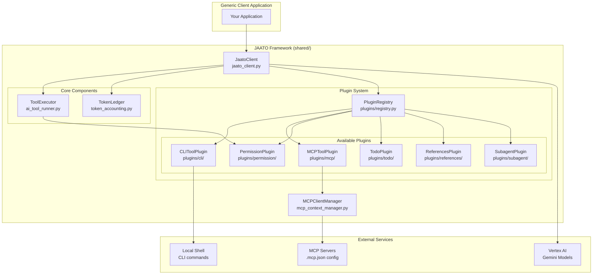
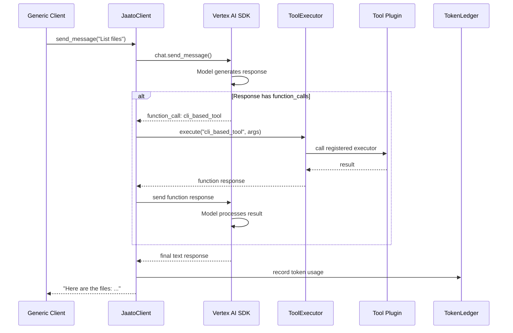
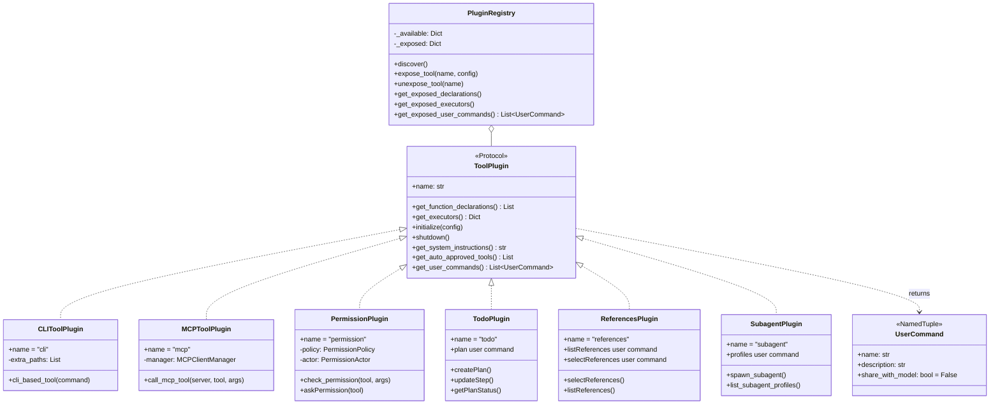

# JAATO Framework Architecture

This document describes the architecture of the jaato framework and how a generic client uses it.

## High-Level Overview

```
┌─────────────────────────────────────────────────────────────────────────────┐
│                           GENERIC CLIENT APPLICATION                         │
│  (Your code that wants to use AI with tools)                                │
└─────────────────────────────────────────────┬───────────────────────────────┘
                                              │
                                              ▼
┌─────────────────────────────────────────────────────────────────────────────┐
│                              JaatoClient                                     │
│  ┌─────────────────────────────────────────────────────────────────────┐    │
│  │  Public API:                                                         │    │
│  │  • connect(project, location, model)                                │    │
│  │  • configure_tools(registry, permission_plugin, ledger)             │    │
│  │  • send_message(message) → response                                 │    │
│  │  • get_history() / reset_session()                                  │    │
│  │  • get_context_usage()                                              │    │
│  │  • get_user_commands() → Dict[str, UserCommand]                     │    │
│  │  • execute_user_command(name, args) → (result, shared)              │    │
│  └─────────────────────────────────────────────────────────────────────┘    │
│                                              │                               │
│              ┌───────────────────────────────┼───────────────────────────┐   │
│              │                               │                           │   │
│              ▼                               ▼                           ▼   │
│  ┌───────────────────┐       ┌───────────────────┐       ┌──────────────┐   │
│  │   ToolExecutor    │       │  PluginRegistry   │       │ TokenLedger  │   │
│  │  (Runs functions) │◄──────│  (Manages tools)  │       │ (Accounting) │   │
│  └─────────┬─────────┘       └───────────────────┘       └──────────────┘   │
│            │                          │                                      │
│            ▼                          ▼                                      │
│  ┌───────────────────┐       ┌────────────────────────────────────────────┐ │
│  │PermissionPlugin   │       │   Tool Plugins                              │ │
│  │ (Access control)  │       │ (CLI, MCP, Todo, References, etc.)          │ │
│  └───────────────────┘       │   • Model tools (function calling)          │ │
│                              │   • User commands (direct invocation)        │ │
│                              └────────────────────────────────────────────┘ │
└─────────────────────────────────────────────────────────────────────────────┘
                                              │
                                              ▼
                               ┌──────────────────────────┐
                               │     Vertex AI / Gemini   │
                               │   (LLM with function     │
                               │    calling support)      │
                               └──────────────────────────┘
```

## Component Diagram (Mermaid)



## Message Flow Sequence



## Plugin System Architecture



## Typical Client Usage

```python
from shared import JaatoClient, PluginRegistry, TokenLedger

# 1. Create and configure registry
registry = PluginRegistry()
registry.discover()
registry.expose_tool('cli')
registry.expose_tool('mcp')

# 2. Create client and connect
client = JaatoClient()
client.connect(
    project_id='my-gcp-project',
    location='us-central1',
    model='gemini-2.0-flash'
)

# 3. Configure tools
ledger = TokenLedger()
client.configure_tools(registry, ledger=ledger)

# 4. Have a conversation (history managed automatically)
response1 = client.send_message("What's in my current directory?")
response2 = client.send_message("Show me the git log")

# 5. Check usage
usage = client.get_context_usage()
print(f"Context: {usage['percent_used']:.1f}% used")
```

## Data Flow Summary

```
┌────────────────┐
│ Generic Client │
└───────┬────────┘
        │ send_message()
        ▼
┌───────────────────────────────────────────────────────────────┐
│                        JaatoClient                            │
│  ┌─────────────────────────────────────────────────────────┐  │
│  │              Internal Function Call Loop                 │  │
│  │                                                          │  │
│  │   ┌──────────┐    ┌──────────────┐    ┌─────────────┐   │  │
│  │   │  Model   │───▶│ Function     │───▶│ ToolExecutor│   │  │
│  │   │ Response │    │ Call Detected│    │   .execute()│   │  │
│  │   └──────────┘    └──────────────┘    └──────┬──────┘   │  │
│  │        ▲                                      │          │  │
│  │        │              ┌───────────────────────┘          │  │
│  │        │              ▼                                  │  │
│  │   ┌────┴─────┐   ┌──────────────┐                       │  │
│  │   │  Model   │◀──│   Function   │                       │  │
│  │   │ Continue │   │   Response   │                       │  │
│  │   └──────────┘   └──────────────┘                       │  │
│  │                                                          │  │
│  │   Loop until model returns text without function calls   │  │
│  └─────────────────────────────────────────────────────────┘  │
└───────────────────────────────────────────────────────────────┘
        │
        ▼
┌────────────────┐
│ Final Response │
└────────────────┘
```

## File Structure

```
shared/
├── __init__.py              # Package exports
├── jaato_client.py          # Main client (entry point)
├── ai_tool_runner.py        # ToolExecutor & function loop
├── token_accounting.py      # TokenLedger for usage tracking
├── mcp_context_manager.py   # MCP server connections
└── plugins/
    ├── __init__.py          # Exports ToolPlugin, PluginRegistry, UserCommand
    ├── base.py              # ToolPlugin protocol, UserCommand NamedTuple
    ├── registry.py          # PluginRegistry
    ├── cli/
    │   └── plugin.py        # CLIToolPlugin (model tools only)
    ├── mcp/
    │   └── plugin.py        # MCPToolPlugin (model tools only)
    ├── permission/
    │   └── plugin.py        # PermissionPlugin (model tools only)
    ├── todo/
    │   └── plugin.py        # TodoPlugin (model tools + user commands)
    ├── references/
    │   └── plugin.py        # ReferencesPlugin (model tools + user commands)
    └── subagent/
        └── plugin.py        # SubagentPlugin (model tools + user commands)
```

## User Commands vs Model Tools

Plugins can provide two types of capabilities:

| Type | Invocation | Example | History |
|------|------------|---------|---------|
| **Model tools** | AI calls via function calling | `cli_based_tool`, `createPlan` | Always in history |
| **User commands** | User types directly | `plan`, `listReferences` | Configurable via `share_with_model` |

User commands are declared via `get_user_commands()` returning `List[UserCommand]`:
- `share_with_model=True`: Command output added to conversation history (model sees it)
- `share_with_model=False`: Output only displayed to user (model doesn't see it)
