# Clarification Plugin

The clarification plugin allows the AI model to request clarification from users when it needs more information to proceed with a task.

## Demo

The demo below shows the model triggering a clarification request with multiple questions of different types (single choice, multiple choice, free text) and the interactive console prompts for user responses.



## Features

- **Multiple questions per request** - Ask several questions in one clarification call
- **Three question types**:
  - `single_choice` - User picks exactly one option
  - `multiple_choice` - User can select multiple options
  - `free_text` - Open-ended text response
- **Optional questions** - Mark questions as `required: false` to allow skipping
- **Default choices** - Pre-select an answer if user doesn't respond
- **Ordinal-based IDs** - Questions and choices use simple numbers (1, 2, 3...)
- **Required/optional display** - Console UI shows status for each question

## Configuration

```python
registry.expose_tool('clarification', {
    'actor_type': 'console',  # 'console' or 'auto'
    'actor_config': {}        # Actor-specific options
})
```

### Actor Types

| Actor | Description | Use Case |
|-------|-------------|----------|
| `console` | Interactive terminal prompts | Production use |
| `auto` | Automatically selects defaults | Testing/automation |

## Tool Schema

The plugin exposes a single tool: `request_clarification`

```json
{
  "context": "Brief explanation of why clarification is needed",
  "questions": [
    {
      "text": "The question text",
      "question_type": "single_choice",
      "choices": ["Option 1", "Option 2", "Option 3"],
      "required": true,
      "default_choice": 1
    }
  ]
}
```

### Question Properties

| Property | Type | Required | Description |
|----------|------|----------|-------------|
| `text` | string | Yes | The question to display |
| `question_type` | enum | No | `single_choice` (default), `multiple_choice`, or `free_text` |
| `choices` | string[] | No | List of choices (for choice questions) |
| `required` | boolean | No | Whether answer is required (default: `true`) |
| `default_choice` | integer | No | 1-based index of default choice |

## Response Format

Responses are keyed by question number (1-based):

```json
{
  "responses": {
    "1": {
      "selected": 2,
      "text": "Staging",
      "type": "single_choice"
    },
    "2": {
      "selected": [1, 3],
      "texts": ["Logging", "Tracing"],
      "type": "multiple_choice"
    },
    "3": {
      "value": "Please enable debug mode",
      "type": "free_text"
    }
  }
}
```

### Response Types

| Question Type | Response Fields |
|---------------|-----------------|
| `single_choice` | `selected` (int), `text` (string), `type` |
| `multiple_choice` | `selected` (int[]), `texts` (string[]), `type` |
| `free_text` | `value` (string), `type` |
| Skipped | `skipped: true` |
| Cancelled | `cancelled: true`, `message` |

## Console UI Example

```
════════════════════════════════════════════════════════
  Clarification Needed
════════════════════════════════════════════════════════

I need to configure the deployment settings.

Please answer the following 3 question(s).
Type 'cancel' at any prompt to cancel all questions.

Question 1/3 [*required]
  Which environment should I deploy to?
    1. Development (default)
    2. Staging
    3. Production
  Enter choice [1-3]:

Question 2/3 [optional]
  (Enter comma-separated numbers, e.g., 1,3)
  Which features to enable?
    1. Logging
    2. Metrics
    3. Tracing
  Enter choices:

Question 3/3 [optional]
  Any deployment notes?
  (press Enter to skip)
  >

✓ All questions answered.
```

## Usage Example

```python
from shared.plugins import PluginRegistry

# Setup
registry = PluginRegistry()
registry.discover()
registry.expose_tool('clarification', {'actor_type': 'console'})

# Get executor
executors = registry.get_exposed_executors()

# Execute clarification request
result = executors['request_clarification']({
    'context': 'I need deployment preferences.',
    'questions': [
        {
            'text': 'Which environment?',
            'choices': ['Development', 'Staging', 'Production'],
            'default_choice': 1
        },
        {
            'text': 'Enable features?',
            'question_type': 'multiple_choice',
            'choices': ['Logging', 'Metrics'],
            'required': False
        }
    ]
})

# Process responses
if result.get('cancelled'):
    print('User cancelled')
else:
    env = result['responses']['1']['selected']  # 1, 2, or 3
    features = result['responses']['2'].get('selected', [])  # [1, 2] or []
```

## Auto-Approved

This tool is auto-approved (no permission prompt required) because it inherently requires user interaction.

## File Structure

```
shared/plugins/clarification/
├── __init__.py      # Package exports, PLUGIN_KIND = "tool"
├── plugin.py        # ClarificationPlugin class
├── models.py        # Data models (Question, Choice, Answer, etc.)
├── actors.py        # User interaction actors (ConsoleActor, AutoActor)
├── README.md        # This file
└── tests/
    ├── test_models.py
    ├── test_actors.py
    ├── test_plugin.py
    └── test_registry_integration.py
```
