# Subagent Plugin

The Subagent plugin (`spawn_subagent`, `list_subagent_profiles`) enables the parent model to delegate tasks to specialized subagents with their own tool configurations, system instructions, and model selection.

## Demo

The demo below shows spawning a code-review subagent to analyze the CLI plugin source file for potential improvements. The subagent runs autonomously and returns its analysis to the parent agent.



## Architecture Overview

The subagent plugin uses the shared `JaatoRuntime` to create lightweight sessions, avoiding redundant provider connections:

```
┌─────────────────────────────────────────────────────────────────────────┐
│                           Parent Agent                                   │
│  ┌─────────────────────────────────────────────────────────────────┐    │
│  │                      JaatoRuntime (Shared)                       │    │
│  │  • Provider config    • PluginRegistry    • Permissions          │    │
│  └─────────────────────────────────────────────────────────────────┘    │
│                    │                               │                     │
│                    ▼                               ▼                     │
│  ┌──────────────────────────┐      ┌──────────────────────────┐        │
│  │   JaatoSession (Main)    │      │  SubagentPlugin          │        │
│  │   • History              │      │  • spawn_subagent        │        │
│  │   • Tools                │      │  • list_profiles         │        │
│  │   • Model                │      │                          │        │
│  └──────────────────────────┘      └────────────┬─────────────┘        │
│                                                  │                      │
│                                    runtime.create_session()             │
│                                                  │                      │
│                                                  ▼                      │
│                                    ┌──────────────────────────┐        │
│                                    │  JaatoSession (Subagent) │        │
│                                    │  • Own history           │        │
│                                    │  • Own model selection   │        │
│                                    │  • Tool subset           │        │
│                                    │  • Shares runtime        │        │
│                                    └──────────────────────────┘        │
└─────────────────────────────────────────────────────────────────────────┘
```

**Benefits of Runtime Sharing:**
- No redundant provider connections for each subagent
- Fast subagent spawning (lightweight session creation)
- Shared permissions and token accounting

## Features

- **Runtime Sharing**: Subagents use `JaatoRuntime.create_session()` for efficient spawning (no redundant connections)
- **Plugin Inheritance**: Subagents automatically inherit the parent's plugin configuration by default
- **Optional Overrides**: Use `inline_config` to override specific properties (plugins, max_turns, system_instructions)
- **Predefined Profiles**: Configure named profiles for common subagent configurations
- **Connection Inheritance**: Subagents automatically inherit parent's GCP project, location, and model
- **Auto-Approved Listing**: `list_subagent_profiles` is auto-whitelisted for permission checks

## Tools Exposed

| Tool | Description | Auto-Approved |
|------|-------------|---------------|
| `spawn_subagent` | Spawn a subagent to handle a task | ✗ (requires permission) |
| `list_subagent_profiles` | List available predefined profiles | ✓ |

## User Commands

| Command | Description | Share with Model |
|---------|-------------|------------------|
| `profiles` | List available subagent profiles | ✓ |

## Usage

### Basic Usage (Inherited Plugins)

The simplest way to spawn a subagent - it inherits all parent plugins:

```python
# Model just provides the task
spawn_subagent(task="Analyze the codebase structure and summarize it")
```

### With Optional Overrides

Override specific properties while inheriting others:

```python
# Override max_turns only (inherits parent's plugins)
spawn_subagent(
    task="Quick file check",
    inline_config={"max_turns": 5}
)

# Override system_instructions only (inherits parent's plugins)
spawn_subagent(
    task="Research this topic",
    inline_config={"system_instructions": "Be concise and factual"}
)

# Override plugins (replaces inherited plugins)
spawn_subagent(
    task="Run shell commands only",
    inline_config={"plugins": ["cli"]}
)
```

### With Predefined Profiles

Use named profiles for common configurations:

```python
spawn_subagent(task="Analyze the code", profile="code_assistant")
```

### With Context

Provide additional context from the current conversation:

```python
spawn_subagent(
    task="Fix the bug we discussed",
    context="The user reported a NullPointerException in UserService.java line 42"
)
```

## Configuration

### Plugin Initialization

```python
from shared.plugins.subagent import SubagentPlugin

plugin = SubagentPlugin()
plugin.initialize({
    'project': 'my-gcp-project',        # Optional: inherited from parent
    'location': 'us-central1',           # Optional: inherited from parent
    'default_model': 'gemini-2.5-flash', # Optional: inherited from parent
    'profiles': {
        'code_assistant': {
            'description': 'Subagent for code analysis',
            'plugins': ['cli'],
            'max_turns': 10,
        },
        'research_agent': {
            'description': 'Subagent for research tasks',
            'plugins': ['mcp', 'references'],
            'system_instructions': 'Focus on accuracy',
            'max_turns': 15,
        }
    },
    'allow_inline': True,                # Allow inline_config (default: True)
    'inline_allowed_plugins': [],        # Restrict inline plugins (empty = all allowed)
})
```

### Connection Inheritance

When using with `JaatoClient`, connection settings are automatically passed to the subagent plugin:

```python
client = JaatoClient()
client.connect(project_id, location, model)
client.configure_tools(registry)  # Automatically configures subagent plugin
```

The subagent plugin receives:
- Project ID, location, and model from parent
- List of exposed plugins from parent (for inheritance)

### Profile Configuration

Profiles can be added programmatically:

```python
from shared.plugins.subagent import SubagentProfile

plugin.add_profile(SubagentProfile(
    name='custom_agent',
    description='Custom subagent configuration',
    plugins=['cli', 'todo'],
    system_instructions='You are a specialized assistant.',
    model='gemini-2.0-flash',  # Override model
    max_turns=20,
    auto_approved=False,       # Require permission to spawn
))
```

## Behavior Summary

| Scenario | Plugins Used | Other Settings |
|----------|--------------|----------------|
| `spawn_subagent(task="...")` | Inherited from parent | Defaults |
| `spawn_subagent(task="...", inline_config={max_turns: 5})` | Inherited from parent | max_turns=5 |
| `spawn_subagent(task="...", inline_config={plugins: ['cli']})` | ['cli'] | Defaults |
| `spawn_subagent(task="...", profile="x")` | From profile | From profile |

## Integration with JaatoClient

```python
from shared import JaatoClient, PluginRegistry

# Setup
registry = PluginRegistry()
registry.discover()
registry.expose_tool('cli')
registry.expose_tool('mcp')
registry.expose_tool('subagent')

client = JaatoClient()
client.connect(project_id, location, model)
client.configure_tools(registry)  # Subagent inherits ['cli', 'mcp']

# Now subagents spawned will have access to cli and mcp by default
response = client.send_message("Spawn a subagent to analyze the code")
```
